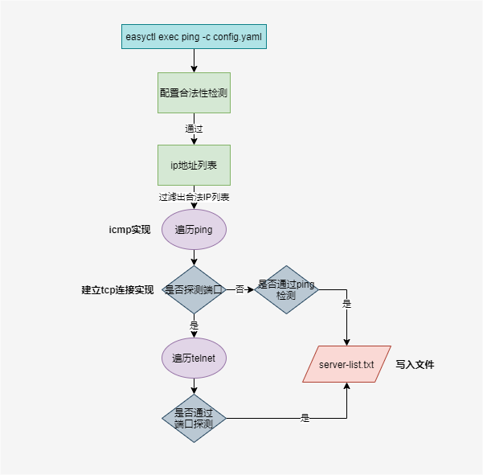

## 多机ping

### 版本&兼容性

> 版本支持

- [v0.7.17-alpha以上](https://github.com/weiliang-ms/easyctl/releases/)

> 兼容性

- [x] `CentOS6`
- [x] `CentOS7`

### 使用方式

> 参考以下链接进行安装

- [安装说明文档](../-安装文档/README.md)

> 生成默认配置文件

```shell
$ easyctl exec ping
INFO[0000] 生成配置文件样例, 请携带 -c 参数重新执行 -> config.yaml
```

> 修改配置文件

`config.yaml`默认配置解析：

`ping`检测`192.168.1.1-192.168.1.255`与`192.168.2.1-192.168.2.255`地址段内主机，如果主机能`ping`通，将`ip`地址入`server-list.txt`文件

```yaml
ping:
  - address: 192.168.1
    start: 1
    end: 255
    #port: 22
  - address: 192.168.2
    start: 1
    end: 255
    #port: 22
```

> 执行

添加`--debug`可以输出详细内容。

```shell
$ easyctl exec ping -c config.yaml --debug
```

### 配置项说明

```yaml
ping:
  - address: 192.168.1
    start: 1
    end: 255
    #port: 22
  - address: 192.168.2
    start: 1
    end: 255
    #port: 22
```

- `ping`: 数组类型列表
    - `address: 192.168.1` 主机地址段，格式为`ip`地址前三位
    - `start`: `address`地址段起始`ip`（`ip`地址第四位值）
    - `end`: `address`地址段结束`ip`（`ip`地址第四位值）
    - `port`: 对`ip`地址执行额外的端口探测（适用于禁`ping`或排除虚拟`IP`地址等场景；建议探测`ssh`端口）

### 配置样例

> 1. 探测`192.168.1.1-192.168.1.255`内主机可达性，并探测`22`端口可达性

```yaml
ping:
  - address: 192.168.1
    start: 1
    end: 255
    port: 22
```

> 2. 探测`192.168.1.1-192.168.1.255`与`192.168.2.1-192.168.2.255`内主机可达性，不探测端口可达性

```yaml
ping:
  - address: 192.168.1
    start: 1
    end: 255
    #port: 22
  - address: 192.168.2
    start: 1
    end: 255
    #port: 22
```

### 执行逻辑

